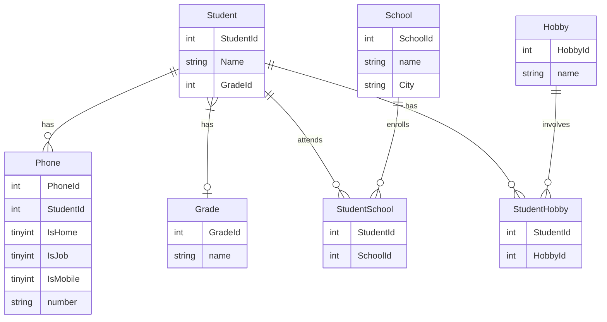

# db2022

## H2 ER Diagram

## H2 Commands that are required to run the script
* curl -L https://raw.githubusercontent.com/samuel-satter/db2022/main/normalisering.sql -o normalisering.sql
* docker start iths-mysql
* docker exec -i iths-mysql mysql -uroot -proot < normalisering.sql

